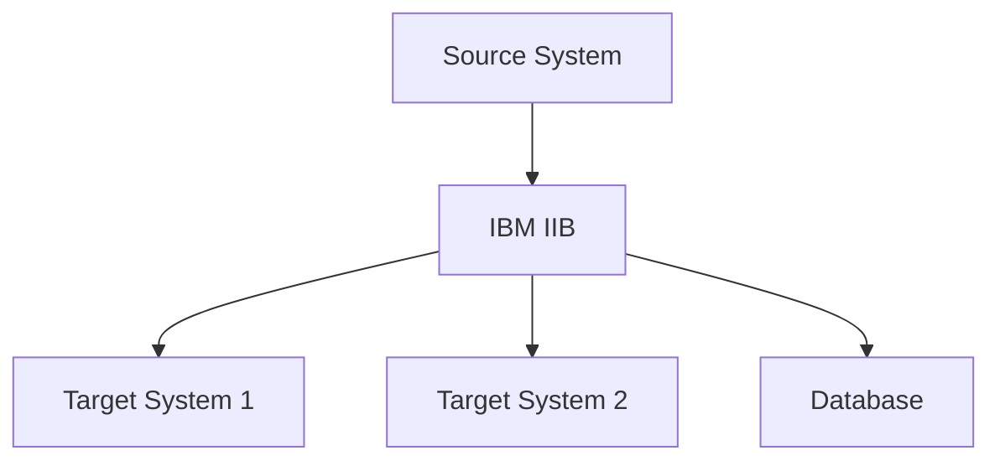

# Assessment Report Template

## Executive Summary
**Project**: CEVA Gen-e2 POC - Renault2MoveECAR Migration  
**Assessment Period**: [Start Date] - [End Date]  
**Assessment Team**: [Team Members]  
**Document Version**: [Version]  

### Key Findings
- [ ] **Business Context**: [Summary of business requirements and expectations]
- [ ] **Technical State**: [Current architecture and code assessment]
- [ ] **Readiness Level**: [Team and infrastructure readiness for Gen-e2]
- [ ] **Critical Risks**: [Top 3-5 risks identified]
- [ ] **Recommended Approach**: [High-level recommendation for implementation]

### Success Probability
**Overall Assessment**: [High/Medium/Low]  
**Confidence Level**: [Percentage]  
**Key Success Factors**: [List of critical factors for success]

---

## Business Discovery Results

### Stakeholder Analysis
| Stakeholder | Role | Expectations | Success Criteria | Influence Level |
|-------------|------|--------------|------------------|-----------------|
| Fabien Tertois | CIO | [Expectations] | [Criteria] | High |
| [Name] | [Role] | [Expectations] | [Criteria] | [Level] |

### Business Requirements
#### Current State
- **Business Process**: [Description of current Renault2MoveECAR flow]
- **Transaction Volume**: [Daily/monthly volumes]
- **Performance Requirements**: [Current SLAs and performance expectations]
- **Integration Points**: [Systems that integrate with current flow]

#### Pain Points Identified
1. **[Pain Point 1]**: [Description and impact]
2. **[Pain Point 2]**: [Description and impact]
3. **[Pain Point 3]**: [Description and impact]

#### Success Criteria Defined
- **Primary Objectives**: [List of primary goals]
- **Secondary Objectives**: [List of secondary goals]
- **Success Metrics**: [Specific measurable outcomes]

---

## Technical Assessment Results

### Current Architecture Analysis
#### IBM IIB Environment
- **Version**: [IBM IIB version]
- **Configuration**: [Key configuration details]
- **Message Flows**: [Number and complexity of flows]
- **Dependencies**: [External system dependencies]

#### ESQL Code Analysis
- **Total Lines of Code**: [Number]
- **Complexity Assessment**: [High/Medium/Low]
- **Business Logic vs Infrastructure**: [Ratio]
- **Code Quality**: [Assessment of current code quality]

### AWS Target Environment
#### Available Services
- **Lambda**: [Current configuration and limits]
- **API Gateway**: [Setup status]
- **CloudWatch**: [Monitoring capabilities]
- **Other Services**: [List of available AWS services]

#### Infrastructure Readiness
- **Networking**: [VPC, security groups, etc.]
- **Security**: [IAM, encryption, compliance]
- **Monitoring**: [Current monitoring setup]
- **CI/CD**: [Current pipeline capabilities]

---

## Tool Stack Assessment

### Current Development Tools
| Tool Category | Current Tool | Gen-e2 Requirement | Gap Analysis | Action Required |
|---------------|--------------|-------------------|--------------|-----------------|
| IDE | [Current] | VSCode | [Gap] | [Action] |
| AI Assistant | [Current] | GitHub Copilot | [Gap] | [Action] |
| Version Control | GitLab | GitLab | No Gap | None |
| Testing | [Current] | Karate + AI | [Gap] | [Action] |

### Gen-e2 Tool Readiness
- **VSCode Setup**: [Status and requirements]
- **GitHub Copilot**: [Licensing and access status]
- **Plugins Required**: [Kroki, Foam, others]
- **Security Policies**: [AI tool usage policies]

---

## Team Readiness Assessment

### Current Team Skills
| Skill Area | Current Level | Required Level | Gap | Training Need |
|------------|---------------|----------------|-----|---------------|
| TypeScript | [Level] | Advanced | [Gap] | [Hours] |
| AWS Lambda | [Level] | Advanced | [Gap] | [Hours] |
| Gen-e2 Methodology | None | Advanced | High | [Hours] |
| AI-Assisted Development | [Level] | Advanced | [Gap] | [Hours] |

### Change Readiness
- **Openness to AI Tools**: [Assessment]
- **Learning Agility**: [Assessment]
- **Process Adaptation**: [Assessment]
- **Collaboration Style**: [Assessment]

---

## Baseline Metrics

### Current Development Metrics
| Metric | Current Value | Target Value | Improvement % |
|--------|---------------|--------------|---------------|
| Development Velocity | [Value] | [Target] | [%] |
| Code Quality Score | [Value] | [Target] | [%] |
| Time to Market | [Value] | [Target] | [%] |
| Defect Rate | [Value] | [Target] | [%] |
| Test Coverage | [Value] | [Target] | [%] |

### Performance Baseline
- **Current Response Time**: [Milliseconds]
- **Current Throughput**: [Transactions per second]
- **Current Availability**: [Percentage]
- **Current Error Rate**: [Percentage]

---

## Gap Analysis

### Technical Gaps
1. **[Gap 1]**: [Description, impact, and mitigation]
2. **[Gap 2]**: [Description, impact, and mitigation]
3. **[Gap 3]**: [Description, impact, and mitigation]

### Process Gaps
1. **[Gap 1]**: [Description, impact, and mitigation]
2. **[Gap 2]**: [Description, impact, and mitigation]

### Skill Gaps
1. **[Gap 1]**: [Description, impact, and mitigation]
2. **[Gap 2]**: [Description, impact, and mitigation]

---

## Risk Assessment

### High Risk Items
| Risk | Probability | Impact | Mitigation Strategy | Owner |
|------|-------------|--------|-------------------|-------|
| [Risk 1] | [H/M/L] | [H/M/L] | [Strategy] | [Owner] |
| [Risk 2] | [H/M/L] | [H/M/L] | [Strategy] | [Owner] |

### Medium Risk Items
| Risk | Probability | Impact | Mitigation Strategy | Owner |
|------|-------------|--------|-------------------|-------|
| [Risk 1] | [H/M/L] | [H/M/L] | [Strategy] | [Owner] |

### Dependencies and Assumptions
- **Critical Dependencies**: [List of critical dependencies]
- **Key Assumptions**: [List of key assumptions]
- **External Factors**: [Factors outside project control]

---

## Recommendations

### Implementation Approach
1. **Recommended Strategy**: [Preferred approach with rationale]
2. **Alternative Approaches**: [Other viable approaches considered]
3. **Key Success Factors**: [Critical factors for success]

### Immediate Actions Required
1. **[Action 1]**: [Description, timeline, owner]
2. **[Action 2]**: [Description, timeline, owner]
3. **[Action 3]**: [Description, timeline, owner]

### Go/No-Go Decision Factors
- **Go Criteria**: [Factors that support proceeding]
- **No-Go Criteria**: [Factors that would prevent proceeding]
- **Conditional Go**: [Factors requiring mitigation before proceeding]

---

## Next Steps

### Week 2 Priorities
1. **[Priority 1]**: [Description and timeline]
2. **[Priority 2]**: [Description and timeline]
3. **[Priority 3]**: [Description and timeline]

### Resource Requirements
- **Team Size**: [Recommended team composition]
- **Tools and Licenses**: [Required tools and licensing]
- **Infrastructure**: [Infrastructure requirements]
- **Training**: [Training requirements and timeline]

### Communication Plan
- **Stakeholder Updates**: [Frequency and format]
- **Team Communication**: [Daily/weekly rhythms]
- **Escalation Process**: [How to handle issues]

---

## Appendices

### A. Technical Documentation
- Detailed architecture diagrams
- Code complexity analysis
- Performance test results

### B. Interview Notes
- Stakeholder interview summaries
- Team feedback compilation
- Technical expert insights

### C. Tool Evaluation
- Detailed tool comparison matrices
- Proof of concept results
- Integration test results
