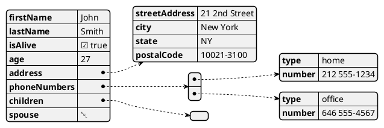

# Discovery Phase Sessions

## IBM IIB Team (ESQL → TypeScript Migration in AWS)

### 1. **Priority Flows and POC Scope**
- **Team:** IBM IIB / Integration  
- **Objective:** Identify which flows to use as representative for the migration and validate the exact scope of the POC.  
- **Audience:** Jose Luis Taranco  
- **Estimated Time:** 1h  
- **Topics:**  
  - Which and how many flows are considered representative? Troy mention 600 but we think a smaller number is better for a POC.  
  - Key characteristics of these flows (complexity, integrations, data formats).  
  - Technical constraints (formats, data volume, external dependencies).  
  - Success criteria expected by the integration team.  

### 2. **Environment and Access Setup**
- **Team:** IBM IIB / Integration  
- **Objective:** Ensure we have the necessary access and environments to work with IIB and AWS.  
- **Audience:** Integration Architects, DevOps, IT Security.  
- **Estimated Time:** 1h  
- **Topics:**  
  - Current access to IBM IIB (source code, configurations).  
  - Review code of a existing flow migrated to TypeScript (if any).
  - Access to AWS (S3, Lambda, IAM roles).  
  - Review of existing pipelines (already defined by CEVA).  
  - Security and compliance policies (if exist).  
  - Code standards (if exist).

### 3. **Code Walkthrough: ESQL vs. TypeScript**
- **Team:** IBM IIB / Integration  
- **Objective:** Review an example of an already migrated flow to understand the translation approach and validation.  
- **Audience:** Integration Developers, QA, Tech Leads.  
- **Estimated Time:** 2h  
- **Topics:**  
  - Live walkthrough of ESQL code and the corresponding TypeScript translation.  
  - Types of tests performed and their results.  
  - Example of input file (e.g., EDI) and the resulting transformed output.  
  - Discussion of challenges faced and lessons learned from the migration.

### 4. **Migration Validation Approach**
- **Team:** IBM IIB / Integration  
- **Objective:** Define how we will validate that a translated flow to TypeScript runs correctly in AWS.  
- **Audience:** Integration Developers, QA, Architects.  
- **Estimated Time:** 1.5h  
- **Topics:**  
  - What minimum tests are required to validate a flow in AWS?  
  - Does already exist EndToEnd tests for validate the right transformation?
  - Minimum comparison metrics (time, effort, quality).  
  - Expectations for migration process documentation.  
  

---

### 1. **Requirements to User Stories (PO & BA Focus)**
- **Team:** Compound  
- **Objective:** Understand how requirements are captured and transformed into user stories.  
- **Audience:** Product Owners, Business Analysts, Scrum Masters.  
- **Estimated Time:** 1.5h  
- **Topics:**  
  - How requirements arrive to the team.  
  - Refinement process into user stories.  
  - Standards or templates used today (if any).  
  - Common pain points in requirement definition.  

### 2. **User Stories to GitLab Tickets (Dev Team Focus)**
- **Team:** Compound  
- **Objective:** Understand how user stories are implemented in code and how development practices are structured.  
- **Audience:** Developers, Tech Leads, Architects.  
- **Estimated Time:** 1.5h  
- **Topics:**  
  - How user stories are turned into GitLab tickets.  
  - Use of technical design documents or architecture updates.  
  - Existing documentation artifacts (DB diagrams, Swagger APIs, architecture diagrams).  
  - Practices for unit test generation and quality standards.  

### 3. **User Story Verification and Acceptance**
- **Team:** Compound  
- **Objective:** Understand the process of validating when a user story is complete and ready for production.  
- **Audience:** POs, QA Leads, Developers, Scrum Masters.  
- **Estimated Time:** 1h  
- **Topics:**  
  - How acceptance criteria are defined and validated.  
  - Standards or checklists used to mark a story as “done”.  
  - Who signs off on readiness for production promotion.  

### 4. **Incident Management (BA)**
- **Team:** Compound
- **Objective:** Understand how incidents are managed from a business perspective.
- **Audience:** Business Analysts, Product Owners, Scrum Masters.
- **Estimated Time:** 1h
- **Topics:**
  -  How incidents are reported and tracked.
  -  Process for prioritizing and addressing incidents.
  -  Communication practices during incident resolution.
  -  Root cause analysis and documentation.
  -  Replication of incidents

### 5. **Automation Testing**
- **Team:** Compound  
- **Objective:** Understand the automation testing practices in place for user stories.  
- **Audience:** Product Owners, Scrum Masters.  
- **Estimated Time:** 1h  
- **Topics:**  
  - Overview of existing automation tests (end-to-end).  
  - Tools and frameworks used for automation testing (karate).  
  - Challenges faced in implementing automation testing.  
  - Best practices for maintaining and updating tests.

### 6. **Legacy System Functional Overview**
- **Team:** FVL  
- **Objective:** Understand the functional purpose and objectives of the FVL legacy system.  
- **Audience:** Business Analysts, Functional Experts, Product Owners.  
- **Estimated Time:** .5h 
- **Topics:**  
  - Functional scope and objectives of FVL.  
  - Existing documentation or business-level descriptions.  
  - Key use cases and pain points in current understanding.  
  - If the team do a maintenance of FVL or is just a legacy system with no changes.

### 7. **Legacy System Technical Overview**
- **Team:** FVL  
- **Objective:** Review the source code of the FVL system  
- **Audience:** Developers, Architects, Senior Tech Leads.  
- **Estimated Time:** 1.5h  
- **Topics:**  
  - High-level architecture of FVL.  
  - Key components and integrations.  
  - Review code 
  - Current level of technical documentation (if any)
  - Typical technical questions developers have when working on FVL.  

### 8. **Desired Documentation from AI Analysis**
- **Team:** FVL  
- **Objective:** Identify what documentation the team would find most valuable from AI-generated analysis.  
- **Audience:** Developers, BAs, Architects.  
- **Estimated Time:** 1h  
- **Topics:**  
  - Preferred documentation formats (diagrams, descriptions, integration maps).  
  - Pain points in current knowledge transfer.  
  - Expectations (generating and maintaining documentation).

### 9. **AI Playbook and Templates (Post-Discovery)**
- **Team:** Compound  
- **Objective:** Define which Gen-e2 practices and templates should be included in CEVA’s SDLC, based on real cases explored during discovery.  
- **Audience:** POs, SMs, Developers, QA Leads.  
- **Estimated Time:** 1.5h  
- **Topics:**  
  - Identify candidate real use cases to apply Gen-e2 practices.  
  - Define key templates to standardize (user stories, designs, documentation).  
  - Governance model and MCP (how templates will be managed centrally).  
  - Prioritization of practices to pilot during the POC.  


```mermaid
sequenceDiagram
    Alice->>John: Hello John, how are you?
    John-->>Alice: Great!
    Alice-)John: See you later!
````

```json
{
  "epic_id": 123,  // ID de una épica existente
  "title": "Mi nuevo issue",
  "description": "Descripción del issue"
}
```



